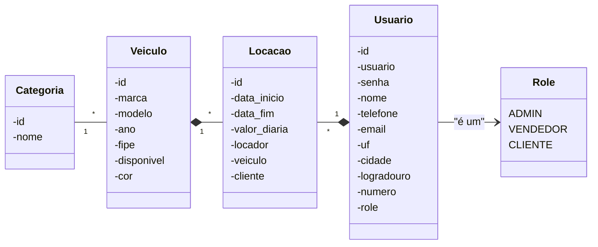

# :checkered_flag: SmartAuto

Sistema de aluguel de veículos, o qual permitirá visualização do catálogo de véiculos disponíveis e gerenciamento das locações.

## :technologist: Membros da equipe

Membro 1: Gabriel Viana Raulino. 509291, Sistemas de informação.

## :bulb: Objetivo Geral
Objetivo do projeto é construir uma aplicação funcional e com boa usabilidade que forneça uma facilidade para locadores de veículos nas atividades de catálogo de véiculo e gestão dos alguéis.

## :eyes: Público-Alvo
Locadores de veículos autônomos

## :star2: Impacto Esperado
O sistema deverá: 
- Facilitar a visualização do catálogo dos véiculos para os clientes.
- Facilitar a gestão dos valores e cobrança dos aluguéis dos véiculos, evitando utilzição de planlinhas ou ferramentas manuais para os cálculos.
- Gerar segurança em armazenar as informações das locações.
- Trazer histórico de locação (cliente e locador).

## :people_holding_hands: Papéis ou tipos de usuário da aplicação

- Cliente:
  - Deslogado: Acessar catálogo de veículos.
  - Logado: Acessar catálogo de veículos e solicitar locação.
- Funcionario:
  - Vendedor: Permissão para gerenciar as locações (aprovar, recusar e alterar) 
  - Admin: Permissão a todas funcionalidades de inserção, deleção e atualização de veículos e funcionários e gerenciamento de locações

## :triangular_flag_on_post:	 Principais funcionalidades da aplicação

- Visulização e busca de veículos: Todos os usuários
- Solitição de aluguel: Cliente logado
- Aprovação de alguel: Funcionário do tipo Vendedor
- Inserção, atualização e deleção de veículos e vendedores: Funcionário do tipo admin

## :spiral_calendar: Entidades ou tabelas do sistema

